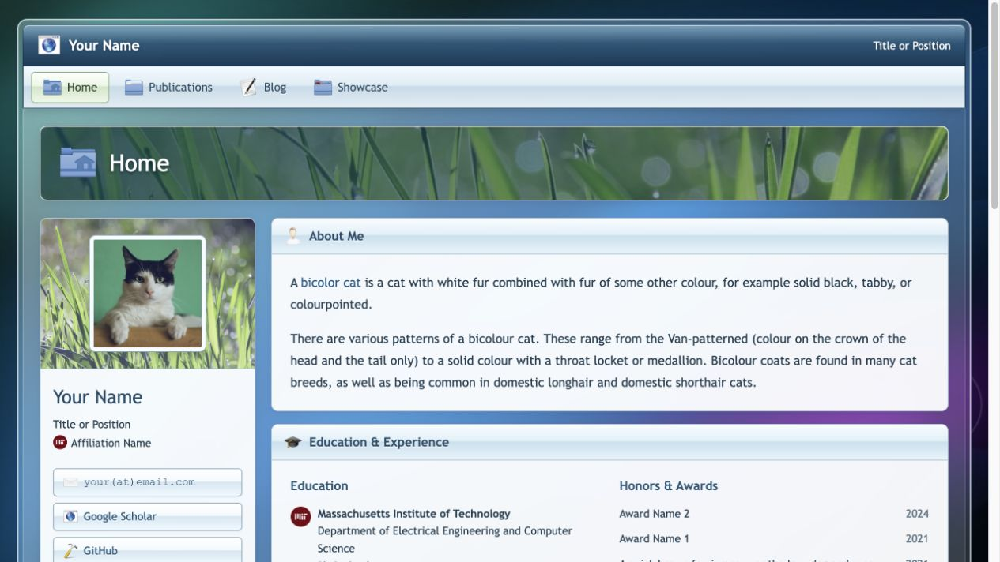
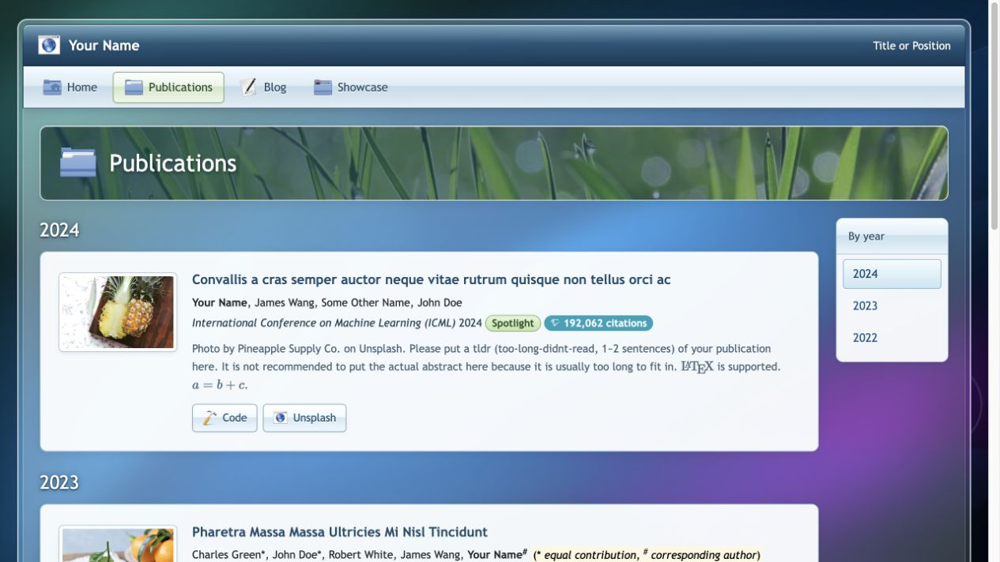

# academic-homepage — Frutiger Aero

A Frutiger Aero variant of [academic-homepage](https://github.com/luost26/academic-homepage), a GitHub Pages (Jekyll) template for personal academic websites. It pairs the original template's profiles, publications, blog, and Showcase with Vista-inspired glass, glossy icons, and nature imagery.

[Live demo](https://luost26.github.io/academic-homepage-frutiger-aero/) · [Main repository](https://github.com/luost26/academic-homepage)

[](https://github.com/luost26/academic-homepage-frutiger-aero/actions/workflows/pages/pages-build-deployment)
[](https://hits.sh/github.com/luost26/academic-homepage-frutiger-aero/)
[](https://github.com/luost26/academic-homepage-frutiger-aero)
[](https://github.com/luost26/academic-homepage-frutiger-aero/forks)

## Screenshots

### Homepage

[](https://luost26.github.io/academic-homepage-frutiger-aero/)

### Publications

[](https://luost26.github.io/academic-homepage-frutiger-aero/publications)

## Frutiger Aero theme

This version uses a Vista-inspired frosted glass frame and translucent page body, reflective navigation and section headers, glossy Oxygen icons, and pale reading surfaces over blue light ribbons. A compact grass banner adds the nature imagery associated with Frutiger Aero.

Personalize the same YAML files in `_data/` and Markdown collections as before. The homepage, publication and blog archives, blog articles, Showcase, and the error page share `_layouts/default.html` and the same 1280px maximum frame width.

- Change colors, glass opacity, spacing, and borders through the CSS variables and theme rules in `assets/css/global.css`. `--aero-glass-blur` controls the frosted backdrop; the frame and page body gradients control its tint and reflections.
- Blog reading styles and the contents sidebar are in `assets/css/blog.css`.
- Shared theme helpers are in `_includes/aero/`; navigation entries may optionally specify an `icon` matching a filename in `assets/aero/icons/32/`.
- Small WebP background variants are in `assets/aero/backgrounds/web/`. Original downloads, vector sources, credits, and license information are documented in [the asset kit](assets/aero/README.md).
- The mobile navigation menu and active year links are handled by `assets/js/aero.js`. The header scrolls with the page, and section links use native browser navigation. The theme includes visible keyboard focus, reduced-motion styles, an opaque blur fallback, and print styles.

Run `bundle exec jekyll serve` to preview the theme locally. Keep the artwork credits and license/source links when reusing the downloaded assets.

## Acknowledgements

The Frutiger Aero theme uses artwork from the following creators and projects:

- [Oxygen icons](https://invent.kde.org/frameworks/oxygen-icons) © KDE/Oxygen contributors — glossy navigation and section icons, licensed under [LGPL-3.0-or-later](assets/aero/licenses/oxygen/LICENSES/LGPL-3.0-or-later.txt).
- [Elarun wallpaper](https://github.com/KDE/plasma-workspace-wallpapers/tree/92cba26d1a117554aa54ed839a481ba657dee5d6/Elarun) by Nuno Pinheiro — the blue light-ribbon backdrop, licensed under [LGPLv3](assets/aero/licenses/wallpapers/COPYING.LGPL3).
- [Grass Background](https://www.publicdomainpictures.net/en/view-image.php?image=242003&picture=grass-background) by Karen Arnold — the grass and bokeh imagery, dedicated to the public domain under [CC0-1.0](assets/aero/licenses/oxygen/LICENSES/CC0-1.0.txt).

See the [asset kit](assets/aero/README.md#sources-and-credits) for full credits and the [asset manifest](assets/aero/manifest.json) for exact sources and derivative details. Keep these credits and the bundled license/source files when reusing the artwork.

## Need Help?

If you run into **any** issues while using this template, or have suggestions for improvements, please don't hesitate to create an issue [here](https://github.com/luost26/academic-homepage/issues/new).

### FAQs

- [Need blogging feature?](https://github.com/luost26/academic-homepage/issues/13#issuecomment-2646371324)
- [How to show citation count for papers?](https://github.com/luost26/academic-homepage/issues/29#issuecomment-3222496187)


## Getting Started

1. First, click the "Use this template" button to create a new repository. The name of the repository should be `<your-github-username>.github.io` (click [here](https://docs.github.com/en/pages/getting-started-with-github-pages/about-github-pages#types-of-github-pages-sites) to learn more about naming a GitHub Pages repository).

### Running Locally (Debug & Preview)

2. Follow the **step 1** and **step 2** of the instruction [here](https://jekyllrb.com/docs/) to install prerequisites and jekyll.

3. Clone your forked repository to your local machine.

4. Run the following command in the root directory of the repository:

   ```bash
   bundle exec jekyll serve
   ```

5. Browse to the displayed URL to see the website.


### Deploying to GitHub Pages

2. Go to the repository settings and enable GitHub Pages. Detailed instructions can be found [here](https://docs.github.com/en/pages/getting-started-with-github-pages/creating-a-github-pages-site#creating-your-site).

3. Navigate to your created website, and follow the instructions displayed on the homepage (if any) to finalize the setup.
